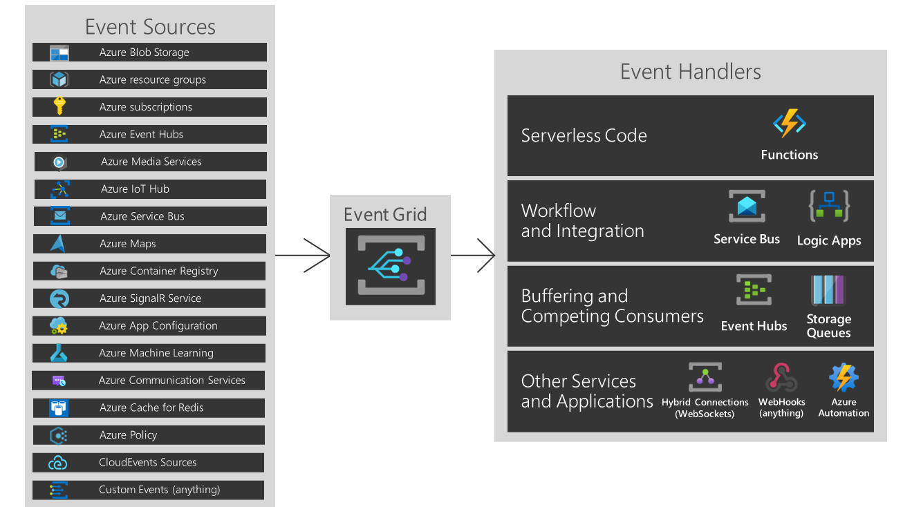

# Azure Cheat Sheet

## Table of Content

[Basics](#basics)

[Resource Groups](#resource-groups)

[Virtual Networking](#virtual-networking)

[Virtual Machine](#virtual-machine)

[Azure AD](#azure-ad)

[Azure Bastion](#azure-bastion)

[Azure Load Balancer](#azure-load-balancer)

[Azure Firewall](#azure-firewall)

[Application Gateway](#application-gateway)

[Azure Front Door](#azure-front-door)

[Traffic Manager](#traffic-manager)

[Security Center](#security-center)

[Azure Storage](#azure-storage)

[Azure App Service](#azure-app-service)

[ARM Template](#arm-template)

[Azure Event Hub](#azure-event-hub)

[Azure Event Grid](#azure-event-grid)

[Azure Service Bus](#azure-service-bus)

[Azure Monitor](#azure-monitor)

[Azure Advisor](#azure-advisor)

[Azure Backup](#azure-backup)

[Azure Site Recovery](#azure-site-recovery)

[Azure Migrate](#azure-migrate)

[Azure SQL](#azure-sql)

[Azure Cosmos DB](#azure-cosmos-db)

[Azure Kubernetes](#azure-kubernetes)

[Azure Blueprints](#azure-blueprints)

[Azure Sentinel](#azure-sentinel)

[Azure File Sync](#azure-file-sync)

[Azure Batch](#azure-batch)

[Network Watcher](#network-watcher)

[Azure Cache for Redis](#azure-cache-for-redis)

[Azure Relay](#azure-relay)

[SendGrid](#sendgrid)

[Azure Notification Hub](#azure-notification-hub)

[Azure Key Vault](#azure-key-vault)

[Script](#script)

## Basics

* All Azure resource types have a scope that defines the level that resource names must be unique. A resource must have a unique name within its scope. Most resources have either resource group or global scope - https://docs.microsoft.com/en-us/azure/cloud-adoption-framework/ready/azure-best-practices/resource-naming

Common Built-in RBAC Roles | Description
-------------------------- | -----------
Contributor | Grants full access to manage all resources, but does not allow you to assign roles in Azure RBAC, manage assignments in Azure Blueprints, or share image galleries
Owner | Grants full access to manage all resources, including the ability to assign roles in Azure RBAC
Reader | View all resources, but does not allow you to make any changes
User Access Administrator | Lets you manage user access to Azure resources
Password Administrator | Allows passwords to be reset for non-admin accounts and helpdesk admins
User Administrator | Allows management of all aspects of users, groups and admin password resets

* RBAC roles can be assigned to users or groups at the subscription, resource group, or resource level (IAM blade). E.g. if at a resource group level, a user is assigned the contributor role, the user will be able to manage all resources within the resource group
* Resource Locks
  * **CanNotDelete** - Authorized users can read or modify the resource, but can't delete the resource
  * **ReadOnly** - Authorized users can only read a resource, but can't delete or update the resource
* Resource Locks can be applied at resource level, resource group level, or subscription level
* Resource Locks when created at the resource group or subscription level, all resources underneath them inherit the lock
* **RPO** - Recovery Point Objective - How much data can you afford to lose
* **RTO** - Recovery Time Objective - If an issue occurs and a system goes down, how much time it takes to get things back to normal

## Resource Groups

* A container that holds related resources for an Azure solution
* Generally used to hold resources that share the same lifecycle, so they can be easily deployed, updated, and deleted as a group
* The region of the resource group indicates the region where the resource group metadata will be stored
* The resource group does not require the resources to be created in the same region
* It is a good practice to create the resources in the same region as the resource group because 
  * It is convenient to inherit the region from the resource group
  * If the resource group's region is temporarily unavailable, you can't update resources in the resource group because the metadata is unavailable even though the resources may be up and running
* RBAC can be used to allow an application to access all resources in a resource group
* Naming convention - `rg-<App / Service name>-<Subscription type>-<###>` e.g. `rg-sharepoint-prod-001`
* Two deployment models:
  * Classic - Legacy model
  * Resource Manager - Introduction of the resource group concept for better manageability

## Virtual Networking

### Basics

* Any IP Address range defined in RFC 1918 e.g. 10.0.0.0/16
* Address ranges (CIDR) that are not allowed:
  * 224.0.0.0/4 (Multicast)
  * 255.255.255.255/32 (Broadcast)
  * 127.0.0.0/8 (Loopback)
  * 169.254.0.0/16 (Link-local)
  * 168.63.129.16/32 (Internal DNS)
* Smallest possible subnet is /29 which gives only 3 usable IP addresses
* Azure reserves 5 IP addresses in each subnet:
  * x.x.x.0 (Network address)
  * x.x.x.1 (Default Gateway)
  * x.x.x.2 (DNS Mapping)
  * x.x.x.3 (DNS Mapping)
  * x.x.x.255 (Broadcast)
* Public IP address assigned to an Azure resource allows
  * Internet resources to communicate inbound to the Azure resources
  * Azure resources to communicate outbound to the internet
  * Azure resources to communicate outbound to the Azure public facing services
* A resource without a public IP assigned can communicate outbound. Its address is network address translated by Azure to an unpredictable public address, by default. However, at scale, a NAT Gateway is recommended to avoid TCP timeout error due to unavailability of port on Azure assigned public IP
* Public IP Address SKUs
  * **Basic SKU**
    * No longer default
    * Assigned with static or dynamic allocation method
    * Open by default (NSGs recommended)
    * Assigned to any Azure resource that allows a Public IP
    * Do not support Availability Zones
  * **Standard SKU**
    * Preferred method
    * Always use static allocation
    * Secure by default and closed to all inbound traffic
    * Assigned to NICs, Standard LBs, or App GWs
    * Support Availability Zones and can be zone-redundant or zonal
* Inbound communication with a Standard SKU IP address fails until a network security group is created and associated explicitly to allow the desired inbound traffic
* Virtual Network is tied to a specific region and a specific subscription
* Network Security Group (NSG) can be assigned to VM (NIC) or to Subnet

### Hybrid Connectivity

* Hybrid (local datacenter and Azure Virtual Network) connectivity options -
  * **Site-to-Site (S2S)** - Established between your on-premises VPN device and an Azure VPN Gateway that is deployed in a virtual network
  * **Point to Site (P2S)** - Established between a Azure VPN Gateway and a single computer in your network
  * **Express Route** - Established between your network and Azure Expressroute Gateway, through an ExpressRoute partner. This connection is private. Traffic does not go over the internet
* **Site-to-Site (S2S)**
  * A VPN Gateway needs to be created in Azure with a public IP assigned to it
  * The enterprise datacenter needs to have a VPN device with a public IP assigned and it cannot be behind a NAT
  * The Gateway connection is over IPSec/IKE (IKE v1 or IKE v2) VPN tunnel
  * The connection is encrypted over the internet
  * A gateway subnet of size /27 needs to be created to host the VPN Gateway
  * A Local Network Gateway needs to be created to point to the on-premise router
* **Point to Site (P2S)**
  * Allows remote workers to connect to the Azure. No need for VPN device. Users can connect as long as there is internet connection
  * the connection is encrypted over the internet
  * Users use the native VPN clients on Windows and Mac devices for P2S
  * The Aggregate Throughput Benchmark for a VPN Gateway is S2S + P2S combined. If you have a lot of P2S connections, it can negatively impact a S2S connection due to throughput limitations
  * The Aggregate Throughput (upto 100 Mbps) Benchmark is not a guaranteed throughput due to Internet traffic conditions and your application behaviors
  * A gateway subnet of size /27 needs to be created to host the VPN Gateway
  * A TLS ertificate based authentication mechanism is needed between Azure and the client
  * The root certificate with the public key needs to be installed on the VPN Gateway
  * The user certificate with the private key needs to be installed on the client system
* P2S Possible protocols:
  * **OpenVPN® Protocol**, an SSL/TLS based VPN protocol. OpenVPN can be used to connect from Android, iOS (versions 11.0 and above), Windows, Linux and Mac devices (OSX versions 10.13 and above)
  * **Secure Socket Tunneling Protocol (SSTP)**, a Microsoft proprietary TLS-based VPN protocol. Azure supports all versions of Windows that have SSTP (Windows 7 and later)
  * **IKEv2 VPN**, a standards-based IPsec VPN solution. IKEv2 VPN can be used to connect from Mac devices (OSX versions 10.11 and above)
* **Express Route**
  * This allows connections to offer more reliability, faster speeds, consistent latencies, and higher security than typical connections over the Internet
  * In an ExpressRoute connection, the virtual network gateway is configured with the gateway type 'ExpressRoute', rather than 'Vpn'
  * While traffic that travels over an ExpressRoute circuit is not encrypted by default, it is possible to create a solution that allows you to send encrypted traffic over an ExpressRoute circuit
  * Microsoft uses BGP, an industry standard dynamic routing protocol, to exchange routes between your on-premises network, your instances in Azure, and Microsoft public addresses
  * ExpressRoute connections enable access to the following services:
    * **Microsoft Azure services** (private peering)
    * **Microsoft Office 365 services** (Microsoft peering)
  * Provides Layer 3 connectivity
  * Provides connectivity to all regions in the geopolitical region. But, with the ExpressRoute Premium add-on, it provides connectivity accross all regions
  * Provides built-in redundancy
  * A few blocks of (private or public) IP addresses need to be reserved to configure routing between the private network and Microsoft's Enterprise edge (MSEEs) routers. A minimum /29 subnet or two /30 subnets must be reserved for routing interfaces. The subnet IP range should not overlap with IP ranges used to create virtual networks on Azure
  * **Unlimited**
    * Speeds from 50 Mbps to 10 Gbps
    * Unlimited Inbound data transfer
    * Unlimited Outbound data transfer
    * Higher monthly fee
  * **Metered**
    * Speeds from 50 Mbps to 10 Gbps
    * Unlimited Inbound data transfer
    * Outbound data transfer charged at a predetermined rate per GB
    * Lower monthly fee
  * Gateway Types
    * **Vpn** - To send encrypted traffic across the public Internet, you use the gateway type 'Vpn'. This is also referred to as a VPN gateway. Site-to-Site, Point-to-Site, and VNet-to-VNet connections all use a VPN gateway.
    * **ExpressRoute** - To send network traffic on a private connection, you use the gateway type 'ExpressRoute'. This is also referred to as an ExpressRoute gateway and is the type of gateway used when configuring ExpressRoute.
* A VPN gateway is a specific type of virtual network gateway that is used to send encrypted traffic between an Azure virtual network and an on-premises location over the public Internet
* Each virtual network, including a peered virtual network, can have only one virtual network gateway
* A VPN gateway can be of two types - Vpn and ExpressRoute
* The throughput, SLA, feature etc. of the VPN gateway is determined by the SKU of the gateway

### Peering

* Peerling allows data transfer between virtual networks across Azure subscriptions, Azure Active Directory tenants, deployment models, and Azure regions
* For peered virtual networks, resources in either virtual network can directly connect with resources in the peered virtual network
* Network traffic between peered virtual networks is private. Traffic between the virtual networks is kept on the Microsoft backbone network. No public Internet, gateways, or encryption is required in the communication between the virtual networks
* No bandwidth loss when peering with Virtual Network in the same region
* Peered Virtual Networks must be in one single cloud (i.e. either Azure public cloud regions, or China cloud regions, or Government cloud regions)
* Peered Virtual Networks must have non-overlapping IP address ranges
* Once a virtual network is peered with another virtual network, the addresss space cannot be changed. Workaround - remove peering, adjust address space, add peering back
* The gateway in the peered virtual network can be configured as a transit point to an on-premises network. In this case, the virtual network that is using a remote gateway can't have its own gateway
* Transitive peering is not supported. If A is peered with B, and B with C, A cannot talk to C unless explicitly peered with C
* In a hub and spoke network topology, the hub virtual network can have a VPN Gateway that allows trafiic from the spoke virtual networks to the on-premise virtual networks. The same VPN Gateway can also allow traffic between the spoke virtual networks that are not directly peered with each other
* Traffic between spokes not directly peered can be allowed by the following config:
  * Allow both the **spoke-to-hub** peering connections to use the remote virtual network's (hub network) gateway
  * Allow forwarded traffic from remote virtual network in both the **spoke-to-hub** peering connections
  * Add UDR in the spoke VNets to route the traffic meant for the other spoke to the hub virtual network gateway or other virtual appliance
  * Allow traffic forwraded from remote virtual network in all the peering connections
* The benefits of hub and spoke topology include:
  * Cost savings by centralizing services that can be shared by multiple workloads, such as network virtual appliances (NVAs) and DNS servers, in a single location
  * Overcome subscriptions limits by peering virtual networks from different subscriptions to the central hub
  * Separation of concerns between central IT (SecOps, InfraOps) and workloads (DevOps)
* For service chaining, enable IP forwarding in the NIC of the virtual appliance to be able to forward the traffic

Details | VNet Peering | VPN Gateways
------- | ------------ | ------------
Encrypted? | Software level encryption level encryption is recommended | Yes
Bandwidth Limitations? | No bandwidth limitations | Varies based on type of Gateway from 100 Mbps to 1.25Gps
Private? | Yes, no Public IP endpoints. Routed through Microsoft backbone and is completely private. No public internet involved | Public IP involved
Transitive relationship | If VNet A is peered to VNet B, and VNet B is peered to VNet C, VNet A and VNet C cannot currently communicate. Spoke to spoke communication can be achieved via NVAs or Gateways in the hub VNet | If VNet A, VNet B, and VNet C are connected via VPN Gateways and BGP is enabled in the VNet connections, transitivity works
Typical customer scenarios | Data replication, database failover, and other scenarios needing frequent backups of large data | Encryption specific scenarios that are not latency sensitive and do not need high throughout

### Routing

* Every subnet has a route table that contains the following minimum routes:
  * **LocalVNet** - Route for local addresses (Virtual Network is the next hop address)
  * **Internet** - Route for all traffic destined to the internet (Internet Gateway is the next hop address)
  * **Reserved IP addresses** - Route for all traffic destined to the reserved IP addresses (Next hop address is None. Thus all packets will be dropped)
* For Inbound connectivity a public IP is necessary
* Options for providing inbound internet connection
  * Adding a public IP to the service (not recommended)
  * Place instance behind a LB that has a public IP
  * Use Network Virtual Appliance (NVA) with a public IP
* Possible values for **Next hop types** in a route table:
  * **Virtual Network** - For each address range of the VNet
  * **Internet** - If you don't override Azure's default routes, Azure routes traffic for any address not specified by an address range within a virtual network, to the Internet, with one exception. If the destination address is for one of Azure's services, Azure routes the traffic directly to the service over Azure's backbone network, rather than routing the traffic to the Internet
  * **None** - Traffic routed to the None next hop type is dropped
  * **Virtual network (VNet) peering** - When a virtual network peering is created between two virtual networks, a route is added for each address range within the address space of each virtual network a peering is created for
  * **Virtual network gateway** - One or more routes with Virtual network gateway listed as the next hop type are added when a virtual network gateway is added to a virtual network. If the on-premises network gateway exchanges border gateway protocol (BGP) routes with an Azure virtual network gateway, a route is added for each route propagated from the on-premises network gateway
  * **VirtualNetworkServiceEndpoint** - The public IP addresses for certain services are added to the route table by Azure when a service endpoint is enabled to the service. Service endpoints are enabled for individual subnets within a virtual network, so the route is only added to the route table of a subnet a service endpoint is enabled for
  * **Virtual appliance** - A virtual appliance is a virtual machine that typically runs a network application, such as a firewall
* In Azure, a route table can be associated to zero or more virtual network subnets
* Each subnet can have zero or one route table associated to it
* If multiple routes contain the same address prefix, Azure selects the route type, based on the following priority:
  * User-defined route
  * BGP route
  * System route
* Deploy a virtual appliance into a different subnet than the resources that route through the virtual appliance. Deploying the virtual appliance to the same subnet, then applying a route table to the subnet that routes traffic through the virtual appliance, can result in routing loops, where traffic never leaves the subnet
* NAT Gateway is a completely managed service through which goes all the outbound connections to the internet. The NAT gateway does the address translation from the private IP to a fixed range of public IP. This helps in whitelisting IPs
* Service Endpoints allow VMs on a subnet access Azure services using private IP addresses over secured Azure backbone network. Thus the Azure service public endpoints can be disabled. The setup process is a two step process
  * Create service endpoint on the subnet for the specific Azure service
  * Add the subnet under the firewall of the specific Azure service

### DNS

* **Azure DNS** supports both internet-facing DNS domains and private DNS zones (**Azure Private DNS**)
* Azure DNS provides an **authoritative** DNS service
* If the user buys a custom domain contoso.net, the domain name registrar allows the user to setup NS record to point to the authoritative name server (in this case Azure DNS). The registrar stores the NS records in the .net parent zone
* **Azure Private DNS** manages and resolves domain names in the virtual network 
* Azure provided name resolution provides only basic authoritative DNS capabilities. For a fully featured DNS solution, Azure DNS private zones along with Customer-managed DNS servers must be used
* When resources deployed in virtual networks need to resolve domain names to internal IP addresses, they can use one of three methods:
  * Azure DNS private zones
  * Azure-provided name resolution (public DNS names and internal names)
  * Name resolution that uses customer-managed DNS server (which might forward queries to the Azure-provided DNS servers)
* DNS Name resolution scenarios:
  * **Name resolution for resources in the same VNet** - Azure Provided DNS or Azure DNS private zone
  * **Name resolution for resources between different VNets** - Azure DNS private zones or customer managed DNS servers
  * **Resolution of on-premise names from Azure** - Cusomer managed DNS servers
  * **Resolution of Azure names from on-premise computers** - Customer managed DNS servers forwarding queries to Azure for name resolution
* For the custom DNS changes to take effect, the VMs need to be restarted
* To add a custom domain: TXT and MX records need to be added at the registrar. TXT record is added with alias, destination and TTL. MX record is added with alias, destination, TTL, and priority

## Virtual Machine

* Availability Set
  * Each virtual machine in an availability set is assigned an update domain and a fault domain by the underlying Azure platform
  * Each availability set can be configured with up to three fault domains and twenty update domains
  * Update domains indicate groups of virtual machines and underlying physical hardware that can be rebooted at the same time (planned maintenance)
  * Fault domains define the group of virtual machines that share a common power source and network switch (unplanned)
* Scale Set
  * Scale sets are used to run multiple instances of an application. If one of these VM instances has a problem, customers continue to access your application through one of the other VM instances with minimal interruption
  * An Azure virtual machine scale set can automatically increase or decrease the number of VM instances that run the application
  * For additional availability, Availability Zones can be used to automatically distribute VM instances in a scale set within a single datacenter or across multiple datacenters
  * With scale sets, all VM instances are created from the same base OS image and configuration
  * Auto scaling conditions can also be based on other resources such as messages processes by Service Bus etc.
* Custom Data
  * To inject a script or other metadata into a Microsoft Azure virtual machine at provisioning time, custom data is used. Custom data is executed only during the first boot
  * If the script exceeds the total VM provisioning time allowance of 40 mins, the VM Create will fail. Note, if the script fails to execute, or errors during executing, it is not deemed a fatal provisioning failure
* Managed Disk
  * Azure managed disks are block-level storage volumes that are managed by Azure and used with Azure Virtual Machines
  * Managed disks are designed for 99.999% availability. Managed disks achieve this by providing three replicas of your data, allowing for high durability
  * Azure managed disks offer two storage redundancy options, zone-redundant storage (ZRS) as a preview, and locally-redundant storage. ZRS provides higher availability for managed disks than locally-redundant storage (LRS) does. However, the write latency for LRS disks is better than ZRS disks because LRS disks synchronously write data to three copies in a single data center
  * To protect against regional disasters, Azure Backup can be used to create a backup job with time-based backups and backup retention policies
  * Azure Backup supports disk sizes up to 32 tebibyte (TiB) disks
  * Managed disks offer two different kinds of encryption - Server Side Encryption (SSE), which is performed by the storage service, and Azure Disk Encryption (ADE), which is enabled on the OS and data disks for VMs
  * There are a few ways to protect an application using LRS disks from an entire zone failure:
    * Use an application like SQL Server AlwaysOn, that can synchronously write data to two zones, and automatically failover to another zone during a disaster.
    * Take frequent backups of LRS disks with ZRS snapshots.
    * Enable cross-zone disaster recovery for LRS disks via Azure Site Recovery. However, cross-zone disaster recovery doesn't provide zero Recovery Point Objective (RPO).

Detail | Ultra Disk | Premium SSD | Standard SSD | Standard HDD
------ | ---------- | ----------- | ------------ | ------------
Disk type | SSD | SSD | SSD | HDD
Scenario | IO-intensive workloads such as SAP HANA, top tier databases (for example, SQL, Oracle), and other transaction-heavy workloads | Production and performance sensitive workloads | Web servers, lightly used enterprise applications and dev/test | Backup, non-critical, infrequent access
Max disk size | 65,536 gibibyte (GiB) | 32,767 GiB | 32,767 GiB | 32,767 GiB
Max throughput | 2,000 MB/s | 900 MB/s | 750 MB/s | 500 MB/s
Max IOPS | 160,000 | 20,000	| 6,000 | 2,000

* Any client running on a VM can acquire an access token by making a REST call to the VM at the endpoint: `http://169.254.169.254/metadata/identity/oauth2/token`. The token is based on the managed identity service principal and suitable for use as a bearer token in service-to-service calls requiring client credentials
* When a disk is attached to a VM, it remains in a raw disk until it is formatted. To accomplish this, a PowerShell script needs to be deployed to Azure VM scale set instances via the Custom Script extension. The script will be first stored in an Azure Storage container. At the time of installation of Custom Script extension, the script is retrieved from the Azure Storage container
* Accelerated Networking is by default enabled. It reduces latency be removing an additional hop over the virtual switch
* The performance diagnostics tool helps you troubleshoot performance issues that can affect a Windows or Linux virtual machine (VM). Supported troubleshooting scenarios include quick checks on known issues and best practices, and complex problems that involve slow VM performance or high usage of CPU, disk space, or memory

VM Details | Availability
---------- | ------------
Single Instance Virtual Machine using Standard HDD Managed Disks for Operating System Disks and Data Disks | 95 %
Single Instance Virtual Machine using Standard SSD Managed Disks for Operating System Disk and Data Disks | 99.5 %
Single Instance Virtual Machine using Premium SSD or Ultra Disk for all Operating System Disks and Data Disks | 99.9 %
Two or more instances deployed in the same Availability Set or in the same Dedicated Host Group | 99.95 %
Two or more instances deployed across two or more Availability Zones in the same Azure region | 99.99 %

## Azure AD

* AAD - Azure Active Directory - Modern AD service built directly for the cloud
* ADDS - Active Directory Domain Services - Legacy Active Directory installed on Windows server
* AADDS - Azure Active Directory Domain Services - Managed domain services without the need to patch and maintain domain controllers
* Pricing details
  * Free has object limit of 5,00,000. Basic, P1, P2  have no object limit
  * Free users do not have self service password reset, company branding etc.
  * P1, P2 exclusive features - Self-service password reset/change/unlock with on-premises write-back, Multi-Factor Authentication
  * P2 exclusive feature - Identity Protection, Privileged Identity Management (PIM), Access Review, Conditional Access Policies
* Identity Protection alerts the users and administrators about following risks, optionally enforcess password change etc.
  * Atypical travel
  * Anonymous IP address
  * Unfamiliar sign-in address
  * Malware linked IP address
  * Leaked credentials
* Privileged Identity Management allows administrators to grant or make users eligible to assume privileged roles for a fixed duration to perform certain activities
* Conditional Access Policies allow administrators to enforce MFA on users in bulk based on various criteria 
* To enable Privileged Identity Management
  * Login as Global Administrator
  * Verify Identity using MFA
  * Consent to PIM 
* Hybrid identity authentication methods
  * Password Hash Synchronization
    * To be used where the organization wants to reuse their existing on-prem active directory credentials in cloud
    * Azure AD Connect reads the password hashes from on-prem directory, hashes them 1000 times over, and copies them to Azure AD every 2 mins
    * During authentication, there is no dependnecy on on-prem infrastructure
    * Security benefits: leaked credential report, smart lockout
  * Pass-through Authentication
    * To be used where the organization wants to reuse their existing on-prem active directory credentials and security policies in cloud that are not supported in Azure AD
    * Security benefit: Smart lockout
  * Federation 
    * To be used where the organization has advanced requirements that are not natively supported by Azure AD
    * Advanced requirements that require federation: Sign-on using smartcards or certificates, sign-on using on-premises MFA server, sign-on using 3rd party authentication solution
* Password hash sync can be enabled along with pass-through mechanism and federation to act as a backup. If anything goes wrong with the on-prem infrastructure, a manual failover to password hash sync can make things work. Additionally password protection with leaked credential report is also available with password hash sync
* Azure AD Connect provides the following features:
  * Password hash synchronisation
  * Pass-through authentication
  * Federation integration
  * Synchronisation
  * Health Monitoring
* Azure AD Connect password write back allows writing back the password changes made in the Azure AD to the on-prem Active Directory. However, Azure AD Connect syncs the identity from the on-prem AD to Azure AD and not the other way around
* In Express Settings, the Azure AD Connect installation wizard asks for the following:
  * AD DS Enterprise Administrator credentials
  * Azure AD Global Administrator credentials
* Azure AD P2 license are not required for users with Global Administrator or User Administrator roles to setup access review. However, to conduct access review, Azure AD P2 license is required
* Steps to connect to SQL Server from Virtual Machine
  * Enable Managed Service Identity on virtual machine
  * On the SQL Server, enable one of the users in Azure AD as the admin in SQL Server 
  * Connect to the SQL Server with the admin user (Azure AD Authentication mechanism)
  * `CREATE USER <virtual_machine_name> FROM EXTERNAL PROVIDER` (Successful only if there is a system assigned identity - Step 1)
  * `ALTER ROLE db_datareader ADD MEMBER <virtual_machine_name>`
  * Application on Virtual Machine gets access token from the local service `http://169.254.169.254/metadata/identity/oauth2/token` and connects to the SQL server
  * (Note: IP address of the Virtual Machine needs to be added to the SQL server firewall)
* Steps to connect to Cosmos db from Virtual Machine
  * Enable Managed Service Identity on virtual machine
  * On the cosmos db IAM, assign Account Contributor role to the Virtual Machine (VM is visible only if the system assigned identity is enabled)
  * Application on Virtual Machine gets access token from the local service `http://169.254.169.254/metadata/identity/oauth2/token`, uses the acess token to get the access keys of the db, and then uses the access keys to access the db
* Service Principals - Azure AD applications are created to represent the application. A service principal is then created under the app. If the app needs access to Azure resources in a different tenant, then a service principal for each tenant needs to be associated with the Azure AD app
* 3 authentication methods that can be used for both MFA and self service password reset:
  * Microsoft Authenticator App
  * SMS
  * Voice Call

## Azure Bastion

* Azure Bastion is a fully managed platform PaaS service from Azure that is hardened internally to provide secure RDP/SSH connectivity
* Azure Bastion is deployed per virtual network
* Workings of Azure Bastion
  * The Bastion host is deployed in the virtual network
  * The user connects to the Azure portal using any HTML5 browser
  * The user selects the virtual machine to connect to
  * With a single click, the RDP/SSH session opens in the browser
  * No public IP is required on the Azure VM.
* NSGs are required on target subnets to allow RDP/SSH from Azure Bastion only
* With Azure Bastion we get RDP/SSH session over TLS on port 443 enabling you to traverse corporate firewalls securely
* Azure Bastion is deployed in a dedicated subnet which must be named as AzureBastionSubnet. This subnet must be at least /27 or larger
* Azure Bastion needs a static public IP (Standard SKU)

## Azure Load Balancer

* Azure Load Balancer operates at layer four of the Open Systems Interconnection (OSI) model
* Azure load balancer can be public or internal depending on whether a public or private IP is selected respectively
* By default, Load balancer uses a Five-tuple hash. It provides stickiness within the same transport session. The hash includes:
  * Source IP address
  * Source port (changes for each new flow from the same source IP)
  * Destination IP address
  * Destination port
  * Protocol type
* Affinity to a source IP address is created by using a two or three-tuple hash
* Azure Load Balancer has an idle timeout setting of 4 minutes to 30 minutes. By default, it is set to 4 minutes. To keep the session alive, use TCP keep-alive
* Azure Load Balancer needs following configurations:
  * Frontend IP configuration - Public IP allocation
  * Backend pools - Pooling all backend VMs or scale set
  * Health probes
  * Load balancing rules
  * Inbound NAT rules - Routing rules to individual VMs (It can be used to RDP to individual VMs)
  * Availability SLA - 99.99 %


## Azure Firewall

* Azure Firewall is a managed next-generation firewall that offers network address translation (NAT)
* Azure Firewall bases packet filtering on Internet Protocol (IP) addresses and Transmission Control Protocol and User Datagram Protocol (TCP/UDP) ports, or on application-based HTTP(S) or SQL attributes
* Azure Firewall also leverages Microsoft threat intelligence to identify malicious IP addresses
* Use Azure Firewall alone when there are no web applications in the virtual network
* Azure Firewall in front of Application Gateway when you want Azure Firewall to inspect and filter traffic before it reaches the Application Gateway
* When used behind an Application Gateway, it doesn't do any SNAT as the traffic is coming from and going to a private IP. Therefore User Define Route (UDR) is required to route the traffic through the firewall
* A VPN gateway or ExpressRoute gateway sits in front of Azure Firewall and/or Application Gateway, when the clients are on the on-premise network
* Even if all clients are located on-premises or in Azure, both the Azure Application Gateway and the Azure Firewall need to have public IP addresses, so that Microsoft can manage the services
* In a hub and spoke architecture, Azure Firewall, Application Gateway, and API Management gateway components uasually all go to the hub virtual network
* Can be used with Kubernetes

## Application Gateway

* Azure Application Gateway is a managed web traffic load balancer and HTTP(S) full reverse proxy
* Application Gateway can make routing decisions based on additional attributes of an HTTP request, for example URI path or host headers. This type of routing is known as application layer (OSI layer 7) load balancing
* Application Gateway also uses Web Application Firewall (WAF) to inspect web traffic and detect attacks at the HTTP layer
* Azure Application Gateway can be used as an internal application load balancer or as an internet-facing application load balancer. An internet-facing application gateway uses public IP addresses
* Application Gateway terminates the web session from the client, and establishes a separate session with one of its backend servers
* Azure Firewall and Application Gateway in parallel, the most common design, when you want Azure Application Gateway to protect HTTP(S) applications from web attacks, and Azure Firewall to protect all other workloads and filter outbound traffic
* Integrate reverse proxy services like API Management gateway with Application Gateway to provide functionality like API throttling or authentication proxy
* An application gateway inserts four additional headers to all requests before it forwards the requests to the backend. These headers are x-forwarded-for (source IP), x-forwarded-proto, x-forwarded-port, and x-original-host
* Advantages of TLS termination at the Gateway:
  * Improved performance – The biggest performance hit when doing TLS decryption is the initial handshake. To improve performance, the server doing the decryption caches TLS session IDs and manages TLS session tickets. If this is done at the application gateway, all requests from the same client can use the cached values. If it’s done on the backend servers, then each time the client’s requests go to a different server the client must re‑authenticate. The use of TLS tickets can help mitigate this issue, but they are not supported by all clients and can be difficult to configure and manage
  * Better utilization of the backend servers – SSL/TLS processing is very CPU intensive, and is becoming more intensive as key sizes increase. Removing this work from the backend servers allows them to focus on what they are most efficient at, delivering content
  * Intelligent routing – By decrypting the traffic, the application gateway has access to the request content, such as headers, URI, and so on, and can use this data to route requests
  * Certificate management – Certificates only need to be purchased and installed on the application gateway and not all backend servers. This saves both time and money
* You may not want unencrypted communication to the backend servers. You may have security requirements, compliance requirements, or the application may only accept a secure connection. Azure Application Gateway has end-to-end TLS encryption to support these requirements
* When configured with end-to-end TLS communication mode, Application Gateway terminates the TLS sessions at the gateway and decrypts user traffic. It then applies the configured rules to select an appropriate backend pool instance to route traffic to. Application Gateway then initiates a new TLS connection to the backend server and re-encrypts data using the backend server's public key certificate before transmitting the request to the backend. Any response from the web server goes through the same process back to the end user
* App Gateway backend pool target types
  * IP address or FQDN
  * Virtual machine
  * Virtual machine scale set
  * App services
* Azure Application Gateway can be configured with an Internet-facing VIP or with an internal endpoint that isn't exposed to the Internet. An internal endpoint uses a private IP address for the frontend, which is also known as an internal load balancer (ILB) endpoint
* There are two primary methods of routing traffic, path-based routing and multiple site hosting
* For multiple site hosting, the CNAME record with the domain registrar for both domain names need to point to the domain name of the application gateway
* Web Application Firewall (WAF) is applicable for both Application Gateway and Front Door
* WAF Policy can be used to create custom policies and attached to Application Gateway or Front Door instances
* Availability SLA - 99.95 %

## Azure Front Door

* If Azure Firewall is used in front of the Application Gateway to filter the maliscious traffic, the source client IP can be injected in the client request as HTTP header by placing Azure Front Door in front of the firewall
* Azure Application Gateway and Azure Front Door are both layer 7 load balancers. Azure Application Gateway is a regional service, while Azure Front Door balances load across regions
* The key scenarios why one should use Application Gateway behind Front Door are:
  * Front Door can perform path-based load balancing only at the global level but if one wants to load balance traffic even further within their virtual network (VNET) then they should use Application Gateway
  * Since Front Door doesn't work at a VM/container level, so it cannot do Connection Draining. However, Application Gateway allows you to do Connection Draining
  * With an Application Gateway behind Front Door, one can achieve 100% TLS/SSL offload and route only HTTP requests within their virtual network (VNET)
  * Front Door and Application Gateway both support session affinity. While Front Door can direct subsequent traffic from a user session to the same cluster or backend in a given region, Application Gateway can direct affinitize the traffic to the same server within the cluster
* Azure Front Door needs a public VIP or a publicly available DNS name to route the traffic to
* Azure front door routes traffic to the backend pool that has the least latency
* Availability SLA - 99.99 %

## Traffic Manager

* Azure Traffic Manager is a DNS-based traffic load balancer that enables you to distribute traffic optimally to services across global Azure regions. For webapp, however, Azure Front Door may provide a better performance
* Traffic Manager uses DNS to direct client requests to the most appropriate service endpoint based on a traffic-routing method and the health of the endpoints
* Traffic Manager is resilient to failure, including the failure of an entire Azure region
* Traffic Manager improves application responsiveness by directing traffic to the endpoint with the lowest network latency for the client
* Azure Traffic Manager supports six traffic-routing methods to determine how to route network traffic to the various service endpoints
  * **Priority** - Select Priority when you want to use a primary service endpoint for all traffic, and provide backups in case the primary or the backup endpoints are unavailable
  * **Weighted** - Select Weighted when you want to distribute traffic across a set of endpoints, either evenly or according to weights, which you define. Following are some use cases:
    * **Gradual application upgrade** - Allocate a percentage of traffic to route to a new endpoint, and gradually increase the traffic over time to 100%.
    * **Application migration to Azure** - Create a profile with both Azure and external endpoints. Adjust the weight of the endpoints to prefer the new endpoints.
    * **Cloud-bursting for additional capacity** - Quickly expand an on-premises deployment into the cloud by putting it behind a Traffic Manager profile. When you need extra capacity in the cloud, you can add or enable more endpoints and specify what portion of traffic goes to each endpoint.
  * **Performance** - Select Performance when you have endpoints in different geographic locations and you want end users to use the "closest" endpoint in terms of the lowest network latency
  * **Geographic** - Select Geographic so that users are directed to specific endpoints (Azure, External, or Nested) based on which geographic location their DNS query originates from. This empowers Traffic Manager customers to enable scenarios where knowing a user’s geographic region and routing them based on that is important. Examples include complying with data sovereignty mandates, localization of content & user experience and measuring traffic from different regions
  * **Multivalue** - Select MultiValue for Traffic Manager profiles that can only have IPv4/IPv6 addresses as endpoints. When a query is received for this profile, all healthy endpoints are returned. Use case:
    * The Multivalue traffic-routing method allows you to get multiple healthy endpoints in a single DNS query response. This enables the caller to do client-side retries with other endpoints in the event of a returned endpoint being unresponsive. This pattern can increase the availability of a service and reduce the latency associated with a new DNS query to obtain a healthy endpoint. MultiValue routing method works only if all the endpoints of type ‘External’ and are specified as IPv4 or IPv6 addresses
  * **Subnet** - Select Subnet traffic-routing method to map sets of end-user IP address ranges to a specific endpoint within a Traffic Manager profile. When a request is received, the endpoint returned will be the one mapped for that request’s source IP address. Use case:
    * Subnet routing can be used to deliver a different experience for users connecting from a specific IP space. For example, using subnet routing, a customer can make all requests from their corporate office be routed to a different endpoint where they might be testing an internal only version of their app. Another scenario is if you want to provide a different experience to users connecting from a specific ISP (For example, block users from a given ISP)
* Endpoint Types
  * **Azure endpoints** are used for services hosted in Azure
  * **External endpoints** are used for IPv4/IPv6 addresses, FQDNs, or for services hosted outside Azure that can either be on-premises or with a different hosting provider
  * **Nested endpoints** are used to combine Traffic Manager profiles to create more flexible traffic-routing schemes to support the needs of larger, more complex deployments
* Availability SLA - 99.99 %

## Security Center

* Provides security score, recommendations, quick fixes, vulnerabilities in Azure subscriptions
* Just-in-Time access to VMs - Provides RDP access to VMs for limited time period by adding appropriate rules to Network Security Groups with appropriate priorities

## Azure Data Lake Storage

* Azure Data Lake Storage Gen2 is a set of capabilities dedicated to big data analytics, built on Azure Blob storage
* A fundamental part of Data Lake Storage Gen2 is the addition of a hierarchical namespace to Blob storage
* Data Lake Storage Gen2 allows you to manage and access data just as you would with a Hadoop Distributed File System (HDFS)
* One of the primary access methods for data in Azure Data Lake Storage Gen2 is via the Hadoop FileSystem
* Data Lake Storage Gen2 allows users of Azure Blob Storage access to a new driver, the Azure Blob File System driver or ABFS
* ABFS is part of Apache Hadoop and is included in many of the commercial distributions of Hadoop
* Using ABFS, many applications and frameworks can access data in Azure Blob Storage without any code explicitly referencing Data Lake Storage Gen2
* **Ingesting data into ADLS**
  * **Adhoc data**
    * Local Computer - Azure PowerShell, Azure CLI, Storage Explorer, AzCopy tool
    * Azure Storage Blob - Azure Data Factory, AzCopy tool, DistCp running on HDInsignt cluster
  * **Streamed Data** - The following tools will usually capture and process the data on an event-by-event basis in real-time, and then write the events in batches into Data Lake Storage Gen2 so that they can be further processed
    * Azure Stream Analytics
    * Azure HDInsight Storm
  * **Relational Data**
    * Azure Data Factory
  * **Web server log data**
    * Azure Data Factory
    * Azure PowerShell
    * Azure CLI
  * **Data associated with Azure HDInsight clusters**
    * Azure DistCp
    * AzCopy tool
    * Azure Data Factory
  * **Data stored in on-premises or IaaS Hadoop clusters**
    * Azure Data Factory
  * **Really large datasets**
    * Azure ExpressRoute
* **Processng Data**
  * Azure HDInsight
  * Azure Databricks
* **Visualizing Data**
  * Power BI
* **Download the data**
  * Azure Data Factory
  * Azure DistCp
  * Azure Storage Explorer
  * AzCopy tool
* Data Lake Storage Gen2 supports individual file sizes as high as 5TB
* Azure Active Directory service principals are typically used by services like Azure Databricks to access data in Data Lake Storage Gen2
* Data Lake Storage Gen2 supports the option of turning on a firewall and limiting access only to Azure services
* Data Lake Storage Gen2 handles 3x replication under the hood to guard against localized hardware failures
* Replication options, such as ZRS or GZRS, improve HA, while GRS & RA-GRS improve DR
* For data resiliency with Data Lake Storage Gen2, it is recommended to geo-replicate your data via GRS or RA-GRS that satisfies your HA/DR requirements
* **Distcp**
  * The most recommended tool for copying data between big data stores like Data Lake Storage Gen2, HDFS, or S3
  * Uses MapReduce jobs on a Hadoop cluster (for example, HDInsight) to scale out on all the nodes
  * Option to only update deltas between two locations
  * Handles automatic retries
  * Dynamic scaling of compute
* **Azure Data Factory**
  * Has a limit of cloud data movement units (DMUs), and eventually caps the throughput/compute for large data workloads
  * Does not offer delta updates between Data Lake Storage Gen2 accounts, so directories like Hive tables would require a complete copy to replicate
* Recommended directory structure fo better permissions management
  * IoT structure - {Region}/{SubjectMatter(s)}/{yyyy}/{mm}/{dd}/{hh}/
  * Batch jobs structure - {Region}/{SubjectMatter(s)}/In/{yyyy}/{mm}/{dd}/{hh}/, {Region}/{SubjectMatter(s)}/Out/{yyyy}/{mm}/{dd}/{hh}/, {Region}/{SubjectMatter(s)}/Bad/{yyyy}/{mm}/{dd}/{hh}/

## Azure Storage

* Azure core storage Services
  * **Azure Blobs** - Microsoft's object storage solution for the cloud
  * **Azure Files** - Fully managed file shares in the cloud that are accessible via the industry standard Server Message Block (SMB) protocol or Network File System (NFS) protocol
  * **Azure Queues** - Messaging store for storing large numbers of messages to be processed asynchronously
  * **Azure Tables** - NoSQL datastore for storing large amount of structured, non-relational data
  * **Azure Disks** - Azure managed block-level storage volumes like a physical disk in an on-premises server
* A storage account provides a unique namespace in Azure for your data
* Format of the endpoint URL of the storage services is: `http://*mystorageaccount*.*service*.core.windows.net`, where *service* can be 'blob' (for Blob storage), 'dfs' (for Data Lake Storage Gen2), 'file' (for Azure files), 'queue' (for Azure queue storage), and 'table' (for Azure table storage).
* The types of storage accounts (excluding legacy types)
  * **Sandard general purpose v2** -
    * Basic storage account type for blobs (all types - block, append, page), files, queues, and tables. Recommended for most scenarios using Azure Storage
    * Supports all redundancy types - LRS, GRS, RA-GRS, ZRS, GZRS, RA-GZRS
  * **Premium block blob** -
    * Storage accounts with premium performance characteristics for block blobs and append blobs
    * Recommended for scenarios with high transactions rates, or scenarios that use smaller objects or require consistently low storage latency
    * Supports only LRS and ZRS
    * Backed by SSD
  * **Premium file shares** -
    * Files-only storage accounts with premium performance characteristics
    * Recommended for enterprise or high performance scale applications
    * Supports only LRS and ZRS
    * Backed by SSD
  * **Premium page blobs** -
    * foundation of Azure IaaS Disks
    * Supports only LRS and ZRS
    * Backed by SSD
* Azure storage redundancy types
  * **Locally redundant storage (LRS)** -
    * Replicates data three times within a single data center in the primary region
    * Protects against server rack and drive failures
  * **Zone-redundant storage (ZRS)** -
    * Replicates data synchronously across three Azure availability zones in the primary region
    * Data is still accessible for both read and write operations even if a zone becomes unavailable
  * **Geo-redundant storage (GRS)** -
    * Cross-regional redundancy to protect against regional outages
    * Data is copied synchronously three times in the primary region, then copied asynchronously to the secondary region. In the secondary region, data is replicated synchronously using LRS. For read access to data in the secondary region, enable read-access geo-redundant storage (RA-GRS)
  * **Geo-zone-redundant storage (GZRS)** -
    * Cross-regional redundancy to protect against regional outages
    * Copied across three Azure availability zones in the primary region and is also replicated to a secondary geographic region for protection from regional disasters. In the secondary region, data is replicated synchronously using LRS. For read access to data in the secondary region, enable read-access geo-redundant storage (RA-GZRS)
* With GRS or GZRS, the data in the secondary location isn't available for read or write access unless there is a failover to the secondary region
* If the primary region becomes unavailable, you can choose to fail over to the secondary region. After the failover has completed, the secondary region becomes the primary region, and you can again read and write data
* Because data is replicated to the secondary region asynchronously, a failure that affects the primary region may result in data loss if the primary region cannot be recovered. The interval between the most recent writes to the primary region and the last write to the secondary region is known as the recovery point objective (RPO). The RPO indicates the point in time to which data can be recovered. Azure Storage typically has an RPO of less than 15 minutes, although there's currently no SLA on how long it takes to replicate data to the secondary region
* To determine which write operations have been replicated to the secondary region, your application can check the Last Sync Time property for your storage account. All write operations written to the primary region prior to the last sync time have been successfully replicated to the secondary region, meaning that they are available to be read from the secondary
* Azure Blob Storage supports three types of blobs:
  * **Block blobs**
    * Stores text and binary data
    * Max size 190.7 TiB
  * **Append blobs**
    * Optimized for append operations
    * Append blobs are ideal for scenarios such as logging data from virtual machines
    * Max size 195 GiB
  * **Page blobs**
    * Provides random access to files
    * Max size 8 TiB
    * Stores virtual hard drive (VHD) files and serves as disks for Azure virtual machines
    * Can only use the Hot access tier, they cannot use either the Cool or Archive tiers
* Azure Blob Storage offers different access tiers:
  * **Hot** -
    * Optimized for storing data that is accessed frequently
    * Can be set at the account or blob level. Blobs inherit account level setting
  * **Cool** -
    * Optimized for storing data that is infrequently accessed
    * Stored for at least 30 days
    * Can be set at the account or blob level. Blobs inherit account level setting
  * **Archive** -
    * Optimized for storing data that is rarely accessed
    * Stored for at least 180 days with flexible latency requirements (on the order of hours)
    * Storage availability - offline
    * Can only be set at the blob level
    * Rehydration priority
      * Standard priority - Within 15 hours
      * High Priority - Within 1 hour for objects under 10 GB
* Only the hot and cool access tiers can be set at the account level. The archive access tier isn't available at the account level
* Hot, cool, and archive tiers can be set at the blob level during upload or after upload
* Archive storage stores data offline and offers the lowest storage costs but also the highest data access costs
* For objects with the tier set at the object level, the account tier won't apply. The archive tier can be applied only at the object level. You can switch between these access tiers at any time
* Data must remain in the archive tier for at least 180 days or be subject to an early deletion charge
* For small objects, a high priority rehydrate may retrieve the object from archive in under 1 hour
* While a blob is in archive storage, the blob data is offline and can't be read, overwritten, or modified
* To read or download a blob in archive, you must first rehydrate it to an online tier
* You can't take snapshots of a blob in archive storage. However, the blob metadata remains online and available, allowing you to list the blob, its properties, metadata, and blob index tags
* Setting or modifying the blob metadata while in archive is not allowed; however you may set and modify the blob index tags
* Blob Storage lifecycle management offers a rich, rule-based policy that you can use to transition your data to the best access tier and to expire data at the end of its lifecycle
* Data stored in a block blob storage account (Premium performance) cannot currently be tiered to hot, cool, or archive using Set Blob Tier or using Azure Blob Storage lifecycle management. To move data, you must synchronously copy blobs from the block blob storage account to the hot access tier in a different account
* Blob storage lifecycle management offers a rich, rule-based policy to transition data to the best access tier and expire data at the end of its lifecycle
* Azure storage service is designed to embrace a strong consistency model which guarantees that when the Storage service commits a data insert or update operation all further accesses to that data will see the latest update
* The Azure storage service uses snapshot isolation to allow read operations to happen concurrently with write operations within a single partition. Snapshot isolation guarantees that all reads see a consistent snapshot of the data even while updates are occurring – essentially by returning the last committed values while an update transaction is being processed
* You can opt to use either optimistic or pessimistic concurrency models to manage access to blobs and containers in the Blob service. If you do not explicitly specify a strategy last writes wins is the default
* **Optimistic concurrency** for blobs
  * Retrieve a blob from the storage service, the response includes an HTTP ETag Header value that identifies the current version of the object in the storage service
  * When you update the blob, include the ETag value you received in step 1 in the If-Match conditional header of the request you send to the service.
  * The service compares the ETag value in the request with the current ETag value of the blob
  * If the current ETag value of the blob is a different version than the ETag in the If-Match conditional header in the request, the service returns a 412 error to the client. This indicates to the client that another process has updated the blob since the client retrieved it
  * If the current ETag value of the blob is the same version as the ETag in the If-Match conditional header in the request, the service performs the requested operation and updates the current ETag value of the blob to show that it has created a new version
* **Pessimistic concurrency** for blobs
  * To lock a blob for exclusive use, you can acquire a lease on it
  * When you acquire a lease, you specify for how long you need the lease: this can be for between 15 to 60 seconds or infinite, which amounts to an exclusive lock
  * You can renew a finite lease to extend it, and you can release any lease when you are finished with it
  * The Blob service automatically releases finite leases when they expire.
  * Leases enable different synchronization strategies to be supported, including exclusive write / shared read, exclusive write / exclusive read and shared write / exclusive read. Where a lease exists the storage service enforces exclusive writes (put, set and delete operations) however ensuring exclusivity for read operations requires the developer to ensure that all client applications use a lease ID and that only one client at a time has a valid lease ID
  * Read operations that do not include a lease ID result in shared reads.
* Object replication asynchronously copies block blobs between a source storage account and a destination account
* Prerequisite of object replication
  * Change Feed enabled on source account
  * Blob Versionng enabled on both source and destination account
* **Change Feed**
  * Provides transaction logs of all the changes that occur to the blobs and the blob metadata in storage account
  * The change feed provides ordered, guaranteed, durable, immutable, read-only log of these changes
  * Stored as blobs in a special container in the same storage account in Avro format
* The Table service uses optimistic concurrency checks as the default behavior when you are working with entities
* Azure Defender for Storage is an Azure-native layer of security intelligence that detects unusual and potentially harmful attempts to access or exploit storage accounts. It is applicable for:
  * Blob Storage
  * Azure Files
  * Azure Data Lake Storage Gen2
* Only Blobs and Azure Files can use customer managed keys for encryption. Azure tables and queues always use Azure managed encryption keys
* Immutable Blob Storage - Blobs once created cannot be modified or deleted. Two policies
  * **Legal hold** - indefinite hold
  * **Time based retention**
* A shared access signature (SAS) provides secure delegated access to resources in a storage account. Types of SAS:
  * User delegation SAS - secured with Azure Active Directory (Azure AD) credentials and applies to blob storage only
  * Service SAS - secured with the storage account key and delegates access to a resource in only one of the Azure Storage services: Blob storage, Queue storage, Table storage, or Azure Files
  * Account SAS - secured with the storage account key and delegates access to resources in one or more of the storage services
* SAS can be created with HTTP or HTTPS access protocols and it can also be restricted to specific IP addressess
* SAS created with stored access policies can be revoked by deleting the policy

## Azure App Service

* Azure App Service is an HTTP-based service for hosting web applications, REST APIs, and mobile back ends
* App Service has first-class support for ASP.NET, ASP.NET Core, Java, Ruby, Node.js, PHP, or Python
* App Service automatically patches and maintains the OS and language frameworks
* App service allows deploying app in a custon Linux/Windows container
* DevOps support
* Scale up or out - manually or automatically
* App Service is ISO, SOC, and PCI compliant
* App Service backup and restore feature restrictions:
  * App Service plan must be in the Standard, Premium or Isolated tier
  * Azure storage account and container in the same subscription as the app need to be created
  * Backups can be up to 10 GB of app and database content
  * Backups of TLS enabled Azure Database for MySQL is not supported
  * Backups of TLS enabled Azure Database for PostgreSQL is not supported
  * A firewall enabled storage account as the destination is not supported

Pricing Tier | Description
------------ | -----------
Free - F1 | Shared Cores (60 CPU minutes / day). 1 GB RAM. 1 GB storage. Used only for development and testing purpose. 10 apps per plan. 1 instance max.
Shared - D1 | Shared Cores (240 CPU minutes / day). 1 GB RAM. 1 GB storage. Used only for development and testing purpose. Custom domain supported. 100 apps per plan. 1 instance max.
Basic - B1 | 1 Core. 1.75 GB RAM. 10 GB storage. No advanced autoscale or traffic management. SSL certificates. unlimited apps per plan. 3 instances max
Basic - B2 | 2 Cores. 3.50 GB RAM. 10 GB storage. No advanced autoscale or traffic management. SSL certificates. unlimited apps per plan. 3 instances max
Basic - B3 | 4 Cores. 7 GB RAM. 10 GB storage. No advanced autoscale or traffic management. SSL certificates. unlimited apps per plan. 3 instances max
Standard - S1 | 1 Core. 1.75 GB RAM. 50 GB storage. VNet connectivity. Supports autoscale. 10 instances max. Scheduled backups every 2 hours, a maximum of 12 backups per day. Staging slots 5
Standard - S2 | 2 Cores. 3.50 GB RAM. 50 GB storage. VNet connectivity. Supports autoscale. 10 instances max. Scheduled backups every 2 hours, a maximum of 12 backups per day. Staging slots 5
Standard - S3 | 4 Cores. 7 GB RAM. 50 GB storage. VNet connectivity. Supports autoscale. 10 instances max. Scheduled backups every 2 hours, a maximum of 12 backups per day. Staging slots 5
Premium v2 - P1v2 | 1 Core. 3.50 GB RAM. 250 GB storage. VNet connectivity. Provides SSD storage, Dv2 series. 30 instances max. Scheduled backups every hour, a maximum of 50 backups per day. Staging slots 20
Premium v2 - P2v2 | 2 Cores. 7 GB RAM. 250 GB storage. VNet connectivity. Provides SSD storage, Dv2 series. 30 instances max. Scheduled backups every hour, a maximum of 50 backups per day. Staging slots 20
Premium v2 - P3v2 | 4 Cores. 14 GB RAM. 250 GB storage. VNet connectivity. Provides SSD storage, Dv2 series. 30 instances max. Scheduled backups every hour, a maximum of 50 backups per day. Staging slots 20
Premium v3 - P1v3 | 2 Cores. 8 GB RAM. 250 GB storage. VNet connectivity. Container support. 30 instances max. Scheduled backups every hour, a maximum of 50 backups per day. Staging slots 20
Premium v3 - P2v3 | 4 Cores. 16 GB RAM. 250 GB storage. VNet connectivity. Container support. 30 instances max. Scheduled backups every hour, a maximum of 50 backups per day. Staging slots 20
Premium v3 - P3v3 | 8 Cores. 32 GB RAM. 250 GB storage. VNet connectivity. Container support. 30 instances max. Scheduled backups every hour, a maximum of 50 backups per day. Staging slots 20
Isolated - l1 | 1 Core. 3.50 GB RAM. 1 TB storage. Mission critical workload in virtual network. Can scale upto 100 instances. Private dedicated environment called App Service Environment. Dv2 series VM with SSD storage. 100 instances max
Isolated - l2 | 2 Cores. 7 GB RAM. 1 TB storage. Mission critical workload in virtual network. Can scale upto 100 instances. Private dedicated environment called App Service Environment. Dv2 series VM with SSD storage. 100 instances max
Isolated - l3 | 4 Cores. 14 GB RAM. 1 TB storage. Mission critical workload in virtual network. Can scale upto 100 instances. Private dedicated environment called App Service Environment. Dv2 series VM with SSD storage. 100 instances max

Logging Types | Description
------------- | -----------
Application logging | Both Windows & Linux. Both blob storage & file system. Logs messages generated by application code
web server logging | only Windows. Both blob storage & file system. Raw HTTP request data in the W3C extended log file format. Each log message includes data such as the HTTP method, resource URI, client IP, client port, user agent, response code, and so on
Detailed error messages | only Windows | only File system | Copies of the .htm error pages that would have been sent to the client browser. For security reasons, detailed error pages shouldn't be sent to clients in production, but App Service can save the error page each time an application error occurs that has HTTP code 400 or greater. The page may contain information that can help determine why the server returns the error code
Failed request tracing | only Windows | only File system | Detailed tracing information on failed requests, including a trace of the IIS components used to process the request and the time taken in each component. It's useful if you want to improve site performance or isolate a specific HTTP error. One folder is generated for each failed request, which contains the XML log file, and the XSL stylesheet to view the log file with
Deployment logging | Both Windows & Linux | only File system | Logs for when you publish content to an app. Deployment logging happens automatically and there are no configurable settings for deployment logging. It helps you determine why a deployment failed. For example, if you use a custom deployment script, you might use deployment logging to determine why the script is failing

* App Service availability SLA from Basic - 99.95 %
* WebJobs is a feature of Azure App Service that enables you to run a program or script in the same instance as a web app, API app, or mobile app. There is no additional cost to use WebJobs
* Two types of WebJobs - continuous & triggered
* Azure Function
  * Large, long-running functions can cause unexpected timeout issues
  * A function can become large because of many Node.js dependencies. Importing dependencies can also cause increased load times that result in unexpected timeouts
* Timeout - 10 mins max (Consumption plan), Unlimited max (Premium plan)
* Azure function availability SLA for both Consumption & Premium plan - 99.95 %

## ARM Template

* Parameters are used for settings that vary according to the environment, like SKU, size, or capacity
* It's recommended to run the ARM test toolkit and the what-if operation on the templates before deploying them
  * The test toolkit checks whether the template uses best practices. It provides warnings when it identifies changes that could improve how the template is implemented
  * The what-if operation shows the changes the template will make to the environment. It returns any syntax or other errors it can detect about the final state.
* The copy element is used to specify more than one instance. Copy can be used on resources, properties, variables, and outputs
* Azure PowerShell or Azure CLI scripts can be included in templates
* If a script needs to be run on a host operating system in a VM, then the custom script extension and/or DSC would be a better choice. However, deployment scripts have advantages, such as setting the timeout duration
* When deploying resources using templates, the deployment mode is either an incremental update or a complete update - the default mode is incremental
* In complete mode, Resource Manager deletes resources that exist in the resource group but aren't specified in the template
* Sections of template:
  * $schema - required
  * contentVersion - required
  * apiProfile - optional
  * parameters - optioanl
  * variables - optional
  * functions - optional
  * resources - required
  * outputs - optional
* As ARM deployments become more complex, linked and nested templates can be used to break these deployments down into smaller reusable components
* By default, Resource Manager creates the resources in parallel. It applies no limit to the number of resources deployed in parallel, other than the total limit of 800 resources in the template. The order in which they're created isn't guaranteed
* To serially deploy more than one instance of a resource, mode needs to be set to `serial` and `batchSize` to the number of instances to deploy at a time. With `serial` mode, Resource Manager creates a dependency on earlier instances in the loop, so it doesn't start one batch until the previous batch completes
* `dependsOn` element is used to specify that a resource is deployed after another resource. To deploy a resource that depends on the collection of resources in a loop, the name of the `copy` loop in the `dependsOn` element needs to be provided
  * `Microsoft.Network/virtualNetworks` `dependsOn` 
    * `Microsoft.Network/networkSecurityGroups`
  * `Microsoft.Network/networkInterfaces` `dependsOn`
    * `Microsoft.Network/publicIPAddresses`
    * `Microsoft.Network/virtualNetworks`
  * `Microsoft.Compute/virtualMachines` `dependsOn`
    * `Microsoft.Storage/storageAccounts`
    * `Microsoft.Network/networkInterfaces`
* If a parameter doesn't have a default value and isn't specified in the parameter file, the template execution will prompt to provide a value
* string or object parameters can be marked as secure. The value of a secure parameter isn't saved to the deployment history and isn't logged
* Instead of putting a secure value (like a password) directly in template or parameter file, the value can be retrieved from an Azure Key Vault during a deployment by referencing the key vault and secret in the parameter file

## Azure Event Hub

* Event publishers can publish events using HTTPS or AMQP 1.0 or Apache Kafka (1.0 and above)
* All Event Hubs consumers connect via the AMQP 1.0 session. All Kafka consumers connect via the Kafka protocol 1.0 and later
* Kafka `Cluster` is equivalent to EventHub `Namespace`
* Scale in Event Hubs is controlled by the number of `throughput units` provisioned. A single throughput lets you:
  * Ingress: Up to 1 MB per second or 1000 events per second (whichever comes first)
  * Egress: Up to 2 MB per second or 4096 events per second
* Beyond the capacity of the purchased throughput units, ingress is throttled and a ServerBusyException is returned. Egress does not produce throttling exceptions, but is still limited to the capacity of the purchased throughput units
* Up to 20 throughput units can be purchased for an Event Hubs namespace and are shared across all event hubs in that namespace
* Event Hubs can automatically scale up throughput units when the throughput limit is reached if the `Auto-Inflate` feature is used
* With Event Hub, it is possible to write with any of the three supported protocols and read with any another
* Unlike Kafka, Log compaction is not supported by Event Hub (Cosmos DB should be used for such requirements)
* Event Hubs `Capture` enables specifying an Azure Blob storage account and container, or an Azure Data Lake Storage account, which are used to store the captured data beyond the Event Hub retention period
* Captured data is written in Apache Avro format
* Event Hubs Capture enables setting up a window to control capturing. This window is a minimum size and time configuration with a "first wins policy," meaning that the first trigger encountered causes a capture operation. If there is a fifteen-minute, 100 MB capture window and 1 MB worth of data is sent per second, the size window triggers before the time window
* Each partition captures independently and writes a completed block blob at the time of capture, named for the time at which the capture interval was encountered
* The storage naming convention is as follows:

```
{Namespace}/{EventHub}/{PartitionId}/{Year}/{Month}/{Day}/{Hour}/{Minute}/{Second}

https://mystorageaccount.blob.core.windows.net/mycontainer/mynamespace/myeventhub/0/2017/12/08/03/03/17.avro
```

* In the event that the Azure storage blob is temporarily unavailable, Event Hubs Capture will retain the data for the data retention period configured on the event hub and back fill the data once the storage account is available again
* Event Hubs writes empty files when there is no data
* Event Hubs Capture is metered similarly to throughput units: as an hourly charge. The charge is directly proportional to the number of throughput units purchased for the namespace
* Retention period:
  * The default value and shortest possible retention period is 1 day (24 hours)
  * For Event Hubs Standard, the maximum retention period is 7 days
  * For Event Hubs Dedicated, the maximum retention period is 90 days
  * If the retention period is changed, it applies to all messages including messages that are already in the event hub
* The number of partitions is specified at creation and must be between 1 and 32 in Event Hubs Standard. The partition count can be up to 2000 partitions per Capacity Unit in Event Hubs Dedicated
* If you don't specify a partition key when publishing an event, a round-robin assignment is used
* Azure Storage Blob is used as a checkpoint store
* By default, the function that processes the events is called sequentially for a given partition. Subsequent events and calls to this function from the same partition queue up behind the scenes as the event pump continues to run in the background on other threads. Events from different partitions can be processed concurrently and any shared state that is accessed across partitions have to be synchronized
* If high availability is most important, it's better not to target a specific partition (using partition ID/key). Using partition ID/key downgrades the availability of an event hub to partition-level because in the absence of a partition key Event Hub sends the event to a different partition if the first attempted partition is unavailable. This feature is useful in the following scenarios:
  * You don't want a subscription to receive all messages sent to a topic
  * You want to mark up messages with extra metadata when they pass through a subscription
* Service Bus supports standard AMQP 1.0 and HTTP or REST protocols and their respective security facilities, including transport-level security (TLS). Clients can be authorized for access using Shared Access Signature or Azure Active Directory role-based security
* At least once delivery
* Patterns
  * When an incoming torrent of ingested events far exceeds the capacity of Azure Service Bus or Azure Event Grid, a routing pattern can be used where an Event Hub can buffer the event data and an Azure function can route the events to the appropriate Azure Service Bus based on the metadata on the messages
  * For scenarios where an event stream needs to be accessed repeatedly by consumers residing in a different region, unidirectional replication to a secondary Event Hub in the consumer region using an Azure function is preferred
  * Several of Azure's cloud-native analytics services like Azure Stream Analytics or Azure Synapse work best with streamed or pre-batched data served up from Azure Event Hubs, and Azure Event Hubs also enables integration with several open-source analytics packages such as Apache Samza, Apache Flink, Apache Spark, and Apache Storm. If a solution primarily uses Service Bus or Event Grid, these events can easily be made accessible to such analytics systems and also for archival with Event Hubs Capture if we funnel them into Event Hub using Azure function
  * For simple stateless replication of events use Azure function. For more complex stateful replication of events, use Azure Stream Analytics. Transformation, batching, and enrichment are usually best done with Azure Stream Analytics
  * Merge pattern - Each event originally produced into one of the Event Hubs included in the scheme is replicated to the other Event Hubs. As events are replicated, they are annotated such that they are subsequently ignored by the replication process of the replication target. The results of using the merge pattern are two or more Event Hubs that will contain the same set of events in an eventually consistent fashion
* Geo-Disaster Recovery allows creating a primary-secondary replication pairing. In case of a disaster, an instantaneous one-time failover will happen from primary to secondary and the pairing will break

## Azure Event Grid



* At least once delivery
* Push model
* Reactive Programming
* Discrete events
* The maximum allowed size for an event is 1 MB. Events over 64 KB are charged in 64-KB increments
* A system topic in Event Grid represents one or more events published by Azure services such as Azure Storage and Azure Event Hubs. Only Azure services can publish events to system topics
* Custom topics are application and third-party topics
* An event domain is a management tool for large numbers of Event Grid topics related to the same application. An even domain may contain a maximum of 100,000 topics. Domains also provide authorization and authentication control over each topic
* Event sources send events to Azure Event Grid in an array, which can have several event objects
* When posting events to an event grid topic, the array can have a total size of up to 1 MB. Each event in the array is limited to 1 MB
* If an event or the array is greater than the size limits, you receive the response 413 Payload Too Large

## Azure Service Bus

* Once accepted by the broker, the message is always held durably in triple-redundant storage, spread across availability zones if the namespace is zone-enabled
* Service Bus never leaves messages in memory or volatile storage after they've been reported to the client as accepted
* Messages are delivered in pull mode, only delivering messages when requested. Unlike the busy-polling model of some other cloud queues, the pull operation can be long-lived and only complete once a message is available
* While a queue is often used for point-to-point communication, topics are useful in publish/subscribe scenarios
* A subscription rule has a filter to define a condition for the message to be copied into the subscription and an optional action that can modify message metadata
* Enterprise Messaging
* Two different modes in which Service Bus receives messages:
  * **Receive and delete** (At Most Once) - In this mode, when Service Bus receives the request from the consumer, it marks the message as being consumed and returns it to the consumer application. Message loss is possible in case of system crash
  * **Peek lock** (default - Al least Once) - Message is read in two stages. Message loss doesn't occur, but duplicate message is possible
* In a publish-subscribe scenario, producers produce to topic nd consumers consume from subscriptions which support competing consumer pattern. Also, subscriptions support various filtering rules allowing consumers to receive only a subset of the messages
* Three types of filters:
  * **SQL Filter** -
  * **Boolean Filter** - 
  * **Correlation Filter** - 

## Azure Monitor

* Application Insights is aimed at the development team, to help understand how an app is performing and how it's being used. It monitors:
  * Request rates, response times, and failure rates - Find out which pages are most popular, at what times of day, and where the users are. See which pages perform best. If the response times and failure rates go high when there are more requests, then perhaps there is a resourcing problem.
  * Dependency rates, response times, and failure rates - Find out whether external services are slowing you down.
  * Exceptions - Analyze the aggregated statistics, or pick specific instances and drill into the stack trace and related requests. Both server and browser exceptions are reported.
  * Page views and load performance - reported by users' browsers.
  * AJAX calls from web pages - rates, response times, and failure rates.
  * User and session counts.
  * Performance counters from Windows or Linux server machines, such as CPU, memory, and network usage.
  * Host diagnostics from Docker or Azure.
  * Diagnostic trace logs from the app - so that the trace events can be correlated with requests.
  * Custom events and metrics that the developers write in the client or server code, to track business events such as items sold or games won.
* Azure Monitor can be enabled in for multiple virtual machines using Azure Poilicies
* When a virtual machine is on-boarded on Azure Monitor, two agents get installed on the virtual machines - Microsoft Monitoring Agent (a.k.a. Log Analytics Agent), and Dependency Agent
* Activity log allows monitoring activities / operations being performed in a subscription or account viz. resource creation, deletion etc.
* AD Sign-in logs can be fed to Log Analytics workspace using Diagnostics settings (Azure AD P1 / P2 License needed)
* Other Application Insights feature
  * Smart Detection - Using machine learning algorithms on the telemetry data sent to Application Insights, it can identify potential performance problems and failure anomaries
  * Continuous Export - It allows exporting the telemetry data to a storage account account cpntainer
* Azure monitor allows to create alert rules such that based on a custom Log Analytics query result the following can be invoked
  * Automation Runbook
  * Azure Function
  * ITSM
  * Logic App
  * Secure Webhook
  * Webhook
* Alert rules consists of
  * Resource
  * Condition (depending on the resource)
  * Action groups and associated actions
* Alert rules can also send notifications - SMS/ Email / Push / Voice
* The retention period of the Log Analytics data needs to be set at the workspace setting. The retention period at the service level Diagnostic Setting is for the Storage Account
* Log Analytics agent and / or Azure Diagnostics Extension can be used to collect monitoring data from the guest operating system of virtual machines. Key differences are:
  * Azure Diagnostics Extension can be used only with Azure virtual machines. The Log Analytics agent can be used with virtual machines in Azure, other clouds, and on-premises
  * Azure Diagnostics extension sends data to Azure Storage, Azure Monitor Metrics (Windows only) and Event Hubs. The Log Analytics agent collects data to Azure Monitor Logs
  * The Log Analytics agent is required for solutions, VM insights, and other services such as Azure Security Center
* Azure Diagnostics Extension - Windows diagnostics extension (WAD), Linux Diagnostic Extension (LAD) 4.0

## Azure Advisor

* Analyzes resource configuration and usage telemetry and then recommends solutions in 5 areas:
  * Reliability (formerly called High Availability)
  * Security
  * Performance
  * Cost
  * Operatonal Excellence

## Azure Backup

* The Azure Backup service provides simple, secure, and cost-effective solutions to back up the data and recover it from the Microsoft Azure cloud
* Azure Backup offers three types of replication - LRS, GRS, ZRS
* Azure Backup stores backed-up data in vaults - Recovery Services vaults and Backup vaults. A vault is an online-storage entity in Azure that's used to hold data, such as backup copies, recovery points, and backup policies
* Multiple virtual machines can be backed up by creating a backup policy on the recovery services vault and applying that policy to the desired virtual machines
* Back up of on-premises machines:
  * Back up on-premises Windows machines directly to Azure by using the Azure Backup Microsoft Azure Recovery Services (MARS) agent. Linux machines aren't supported (use MABS for for Linux)
  * Back up on-premises machines to a backup server (agentless) - either System Center Data Protection Manager (DPM) or Microsoft Azure Backup Server (MABS). The backup server is then backed up to a Recovery Services vault in Azure
* Back up of Azure VMs:
  * Back up Azure VMs directly. Azure Backup installs a backup extension to the Azure VM agent that's running on the VM. This extension backs up the entire VM
  * Back up specific files and folders on the Azure VM by running the MARS agent
  * Back up Azure VMs to the MABS that's running in Azure, and then the MABS can be backed up to a Recovery Services vault
* DPM allows you to back up data for long-term storage on tape. MABS doesn't provide this functionality
* For Azure Backup to access the storage account, the firewall section must enable the "Allow trusted Microsoft services to access this storage account"

Backup type | Details | Usage
----------- | ------- | -----
Full | A full backup contains the entire data source. Takes more network bandwidth than differential or incremental backups | Used for initial backup
Incremental | An incremental backup stores only the blocks of data that changed since the previous backup. High storage and network efficiency. With incremental backup, there's no need to supplement with full backups | Used by DPM/MABS for disk backups, and used in all backups to Azure. Not used for SQL Server backup

## Azure Site Recovery

* Site Recovery contributes to your business continuity and disaster recovery (BCDR) strategy, by orchestrating and automating replication of Azure VMs between regions, on-premises virtual machines and physical servers to Azure, and on-premises machines to a secondary datacenter
* When an outage occurs at the primary site, Site Recovery allows failing over to the secondary location, and access apps from there. After the primary location is running again, fail back to the primary site is possible
* Protection of VMs using Azure Site Recovery
  * For protection of Hyper-V VMs, the Azure Site Recovery Provider and Azure Site Recovery Agent are installed on the Hyper-V host
  * The Azure Site Recovery Provider orchestrates replication with Site Recovery over the internet. The Recovery Services agent handles data replication
  * When a planned failover is triggered, source VMs are shut down to ensure no data loss
  * An unplanned failover can be triggered, if the primary site is not accessible
  * A test failover can be triggered to test the setup. Once the test is successful, Cleanup test failover action can be triggered to delete the test VMs
* A cache storage account is created in the source region. All changes to the source virtual machine are first written to the cache storage and then replicated to the target storage
* The replication of data from the source virtual machine is based on a replication policy. The default replication policy has the following definitions
  * Recovery points are kept for a duration of 24 hours
  * An App-consistent snapshot is created every 4 hours (Configurable to every hour)
  * There is a crash consistent snapshot taken every 5 minutes
  * Recovery points are then created from every snapshot
* Crash consistent snapshots 
  * This consists of data on the disk and not the data in memory.
  * This does not guarantee data consistency for the operating system or for the applications on the virtual machine
* App consistent snapshots
  * This contains all data from the crash consistent snapshot + data in memory + transactions in progress
* Site Recovery limitations
  * BitLocker not supported
  * Supported OS disk size upto
    * 2048 GB for generation 1 VM
    * 300 GB for generation 2 VM
  * Supported data disk VHD size upto 4095 GB
  * OS disk count 1
  * Data disk count 16 or less
  * Linux Generation 2 VMs aren't supported
  * Shared VHD & FC Disk not supported
* Recovery Service Vault has to be in the same region as the VMs

## Azure Migrate

* Steps of vmware migration
  * **Pre-requisites** - Set up prerequisites and ensure both environments have the needed permissions
  * **Azure Migrate Setup** - Set up an Azure Migrate project, including the tools for assessment and migration
  * **Discover VMs** - Download a virtual machine appliance and deploy it in VMware environment to discover virtual machines and dependencies
  * **Review Assessment** - Review the assessment and dependencies from Azure Migrate while scoping the target migration
  * **Replicate VMs** - Replicate virtual machines from VMware into Azure storage
  * **Test Migration** - Test virtual machines using a test virtual network. Once test is done, cleanup can be invoked to delete the test VMs
  * **Migrate to Production** - Migrate virtual machines into production using a production virtual network

## Azure SQL

* Two pricing models - DTU (Database Transaction Unit) based and vCore based (provides more control over hardware specifications)
* Change in DTU tier causes existing connections to be dropped
* DTU Service tiers
  * Basic - Backup retention 7 days
  * Standard - Backup retention 35 days
  * Premium - Low latency, backup retention 35 days
* Long term retention feature can be used for longer retention
* In the vCores based medel, the serverless tier may have a warmup delay after a period of inactivity
* **Always Encrypted** is a feature designed to protect sensitive data, such as credit card numbers or national identification numbers (for example, U.S. social security numbers), stored in Azure SQL Database or SQL Server databases
* Always Encrypted supports two types of column encryption
  * **Deterministic encryption** - Same encrypted value is produced for a given input text value. Less secured. But allows equality joins, point lookups, grouping, indexes etc.
  * **Randomised encryption** - More secured. But it prevents searching, grouping, indexing the encrypted fields
* If a field is masked, non privileged users will see the data masked
* Azure SQL Managed Instance supports only vCore based pricing model
* Audit log can be stored to an Azure Storage account, a Log Analytics workspace, or Event hubs
* In the event of a disaster,
  * either, a point in time restore is done from a backup
  * or, if a replication is already setup, a failover to the secondary can be done. The primary will then become the read-only secondary
* Auto-failover group can be created to do auto failover to secondary DB when the primary DB fails
* **Transparent Data Encryption (TDE)** encrypts SQL Server, Azure SQL Database, and Azure Synapse Analytics data files. This encryption is known as encrypting data at rest

Recovery method	| RTO	| RPO
--------------- | --- | ---
Geo-restore from geo-replicated backups	| 12 h | 1 h
Auto-failover groups | 1 h | 5 s
Manual database failover | 30 s | 5 s

* Databases in an elastic pool are on a single server. A DB can move to a different pool, if the pool is on the same server as the DB
* Automated Backup v2 automatically configures Managed Backup to Microsoft Azure for all existing and new databases on an Azure VM running SQL Server 2016 or later Standard, Enterprise, or Developer editions. This enables you to configure regular database backups that utilize durable **Azure blob storage**
* In a failover group, 
  * the secondary server must be in a different region than the primary region
  * if a single DB is added to a primary server, a secondary DB will be automatically created in the secondary server
  * If a DB pool is added to the primary server, a pool with the same name has to be present in the secondary region and the DBs will be created automartically in the secondary server
  * If a secondary DB is already present in the secondary server, that geo-replication link is inherited by the group

## Azure Cosmos DB

* Supported APIs
  * Core (SQL)
  * Azure Cosmos DB for MongoDB API
  * Cassandra
  * Azure Table
  * Gremlin (graph)
* Charged based on RU (Request Unit)
* Multi-region read and write can be enabled

## Azure Kubernetes

* Create kubernetes cluster
`az aks create --resource-group myResourceGroup --name myAKSCluster --node-count 1 --enable-addons monitoring --generate-ssh-keys`

* Check nodes
`kubectl get nodes`

* Check pods
`kubectl get pods`

* Deploy application
`kubectl apply -f azure-vote.yaml`

* Delete kubernetes cluster
`az group delete --name myResourceGroup --yes --no-wait`

* Replicate vote-Front
`kubectl scale --replicas=3 deployment/azure-vote-front`

* Check with below command:
`kubectl get pods`

* AutoScale rule
`kubectl autoscale deployment azure-vote-front --cpu-percent=50 --min=3 --max=10`

* Create container registry
`az acr create --resource-group myResourceGroup --name <acrName> --sku Basic`

* List repositories in registry
`az acr repository list --name <acrName> --output table`

* Show the tags of specififc image
`az acr repository show-tags --name <acrName> --repository azure-vote-front --output table`

## Azure Blueprints

* Azure Blueprints enables cloud architects to define a repeatable set of Azure resources that implements and adheres to an organization's standards, patterns, and requirements such that the new environments can be built rapidly with confidence following organizational requirements
* The service is designed to help with environment setup. This setup often consists of a set of resource groups, policies, role assignments, and ARM template deployments
* Blueprints can be assigned to management groups or subscriptions
* Contributor access is needed to save the Blueprint definition in either the management group or the subscription
* Resources deployed by the Blueprint can be protected by the Blueprint resource lock. The lock can only be removed by unassigning the blueprint. even the user with the Owner role cannot remove the lock
* Following types of artifact types can be added to a blue print
  * Policy
  * Role
  * ARM Template
  * Resource Group

## Azure Sentinel

* Azure Sentinel provides datavisualization, incident creation etc. for security
* Provides data in-built data connectors with queries, workbooks etc. that collect data into Log Analytics workspace
* Provides in-built rules and also allows creating custom rules that execute periodically and when query results satisfy conditions, incidents are created
* Security events from Azure or non-Azure windows Virtual Machines can be streamed to Azure Sentinel and security inidents can also be created using rules

## Azure File Sync

* Azure File Sync service can be used to sync files from Azure File Shares on to the on-premise file servers and vice versa. This will provide faster access to the files from on-premise services
* Azure File Sync requires the installation of an agent in the on premise server and registration to the Azure File Sync service instance

## Azure Batch

* Azure Batch creates and manages a pool of compute nodes (virtual machines), installs the applications to run, and schedules jobs to run on the nodes
* A job is meant to run thousands or millions of tasks submitted by the application or client
* The task code is downloaded from the Azure Storage account
* The command to execute in the task is specified during the task creation
* The inputs and outputs are stored in the Azure storage

## Network Watcher

* Tools
  * **IP flow verify** - Detecting traffic filtering problems - Used to detect if a specific type of packet is allowed or denied given the network security group rules in place
  * **Next hop** - Detecting virtual machine routing problems
  * **Connection troubleshoot** - Diagnose connectivity
  * **VPN connectivity**
  * **Packet capture**
  * **Network Security Group logging** - Output in JSON format
  * **Traffic analysis**

## Azure Cache for Redis

* Pricings
  * Basic - Single node cache
  * Standard - 2 node cache. 99.9% SLA
  * Premium - Powerful, high-throughput hardware
* Keys that have a time to live set are eligible for evicion

## Azure Relay

* The Azure Relay service enables you to securely expose services that run in your corporate network to the public cloud. You can do so without opening a port on your firewall, or making intrusive changes to your corporate network infrastructure

## SendGrid

* SendGrid is a cloud-based email service that provides reliable transactional email delivery, scalability, and real-time analytics along with flexible APIs that make custom integration easy

## Azure Notification Hub

* Azure Notification Hubs provide an easy-to-use and scaled-out push engine that enables you to send notifications to any platform (iOS, Android, Windows, etc.) from any back-end (cloud or on-premises)

## Azure Key Vault

REST API methods | Purpose
---------------- | -------
POST | Checks that the vault name is valid and is not already in use
PUT | Create or update a key vault in the specified subscription
DELETE | Deletes the specified Azure key vault
GET | Gets the specified Azure key vault
GET | Gets the deleted Azure key vault
GET | The List operation gets information about the vaults associated with the subscription
GET | The List operation gets information about the vaults associated with the subscription and within the specified resource group
GET | The List operation gets information about the vaults associated with the subscription
GET | Gets information about the deleted vaults in a subscription
POST | Permanently deletes the specified vault. aka Purges the deleted Azure key vault
PATCH | Update a key vault in the specified subscription
PUT | Update access policies in a key vault in the specified subscription

## Script

### Deploy A Simple Web Server

```
#!/bin/bash

sudo apt upgrade -y
sudo apt install apache2 -y
sudo ufw allow 'Apache'
cd /var/www/html
echo "<html><h1>Hello AWS Study - Welcome To My Webpage</h1><body>`hostnamectl`</body></html>" > index.html

```

### Install CNI Plugin for Installing Kubernetes

```
#!/bin/bash

sudo apt upgrade -y
curl https://raw.githubusercontent.com/Azure/azure-container-networking/v1.1.7/scripts/install-cni-plugin.sh > install-cni-plugin.sh
chmod +x install-cni-plugin.sh
sudo ./install-cni-plugin.sh v1.1.7 v0.8.7

```

### Test ARM Template

#### ARM Test Toolkit

Download ARM Test Toolkit: https://aka.ms/arm-ttk-latest

```
cd arm-ttk
Get-ChildItem *.ps1, *.psd1, *.ps1xml, *.psm1 -Recurse | Unblock-File
Import-Module ./arm-ttk.psd1
Test-AzTemplate -TemplatePath /path/to/template
```

#### ARM Validation with WhatIf

```
Install-Module -Name Az -Force
```

```
Connect-AzAccount
```

```
New-AzResourceGroup `
  -Name rg-kube-dev-001 `
  -Location eastus

New-AzResourceGroupDeployment `
  -Whatif `
  -ResourceGroupName rg-kube-dev-001 `
  -TemplateUri "D:\gitrepo\kubernetes-study\lab\arm\azureDeploy.json"
```


## References

* [How to get better outbound connectivity using Azure NAT Gateway | Azure Friday](https://www.youtube.com/watch?v=2Ng_uM0ZaB4)
* [How to choose the right authentication method in Azure Active Directory](https://youtu.be/YtW2cmVqSEw)
